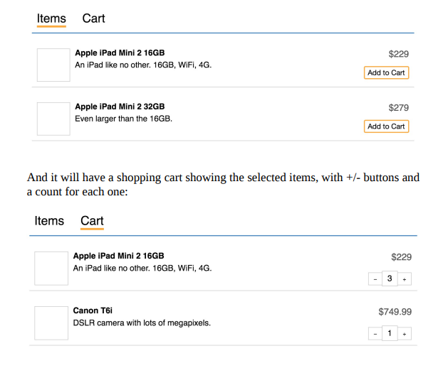
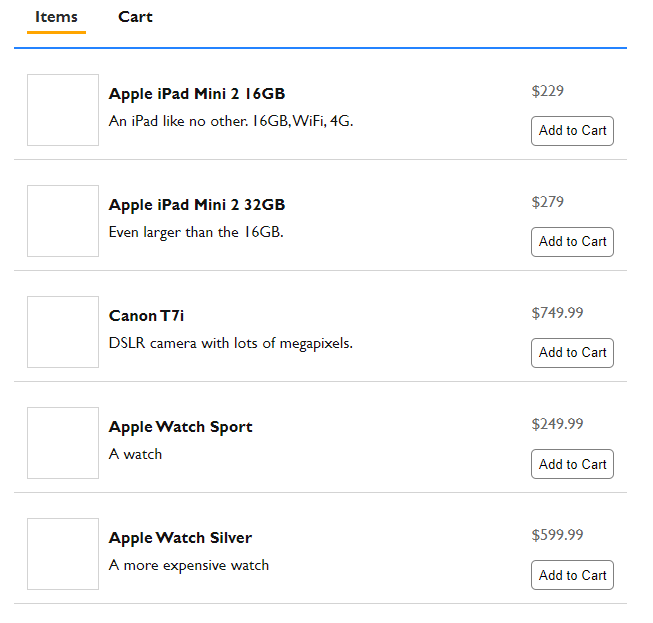
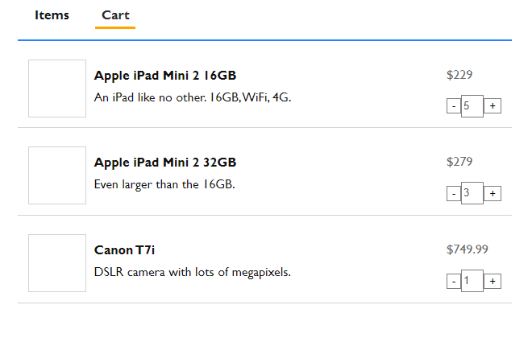

# Pure React Exercises

## Installation Guide
- Create a new react app using **create-react-app [app-name]**. (app-name represents the name you want to give to the app)
- Copy the **App.js**, **CartList.js**, **CartList.css**, **Item.js**, **Item.css**, **ItemList.js**, **Nav.css**, **Nav.js**, and **static-data.js** in the **src** directory.
- run **npm start**.

## Exercise

## Solution

